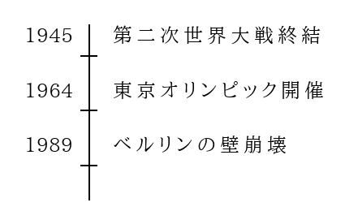

# YAML-based Vertical Timeline Generator

This Python script generates a vertical historical timeline image from YAML data. It's designed to create visually appealing timelines that can be easily customized through a YAML configuration file.

## Requirements

- Python 3.6+
- Pillow (PIL Fork)
- PyYAML

## Installation

1. Clone this repository or download the script.
2. Install the required Python packages:

```bash
pip install pillow pyyaml
```

3. Ensure you have a Japanese font installed on your system. The script looks for `/usr/share/fonts/truetype/fonts-japanese-mincho.ttf` by default.

## Usage

1. Prepare your timeline data in a YAML file. Example format:

```yaml
events:
  - year: 1945
    description: 第二次世界大戦終結
  - year: 1964
    description: 東京オリンピック開催
  - year: 1989
    description: ベルリンの壁崩壊
```

2. Run the script from the command line, providing the path to your YAML file:

```bash
vertical-timeline.py timeline_data.yaml
```

3. Remove extensions from YAML filenames and generate PNG filenames the same directory.



## Troubleshooting

- If you encounter a font-related error, ensure that the specified Japanese font is installed on your system. You can modify the `font_path` variable in the script to use a different font.
- Make sure your YAML file is correctly formatted and encoded in UTF-8.

## License

[MIT](https://choosealicense.com/licenses/mit/)
